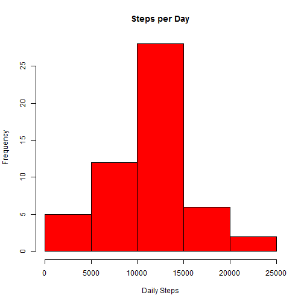

## Coursera Data Scientist Course
## Course 5: Reproducible Research
## Peer Assessment 1

Due Date: October 19 2014

========================================================

This assignment is examing personal movement data collected from activity devices.

Data

The data for this assignment can be downloaded from the course web site:
https://d396qusza40orc.cloudfront.net/repdata%2Fdata%2Factivity.zip

NOTE: The GitHub repository also contains the dataset for the assignment so you do not have to download the data separately.

The variables included in this dataset are:

steps: Number of steps taking in a 5-minute interval (missing values are coded as NA)

date: The date on which the measurement was taken in YYYY-MM-DD format

interval: Identifier for the 5-minute interval in which measurement was taken

The dataset is stored in a comma-separated-value (CSV) file and there are a total of 17,568 observations in this dataset.


## Loading and preprocessing the data

Set the working directory, filenames, and url of the data. If the file doesn't already exist, download it.  If the file has not bee extracted, unzip it.  

Load the CSV file into R.

```r
setwd("E:/Data Science Course 5/Peer Assignment 1")
url <- 'https://d396qusza40orc.cloudfront.net/repdata%2Fdata%2Factivity.zip'
zipfile <- 'repdata-data-activity.zip'
csvfile <- 'activity.csv'

if (!file.exists(zipfile)) download.file(url, zipfile, #method = 'curl'
)
if (!file.exists(csvfile)) unzip(zipfile)

activity <- read.csv(csvfile)
```


## What is mean total number of steps taken per day?
For this part of the assignment, you can ignore the missing values in the dataset.

```r
activity2 <- activity[complete.cases(activity),]
```
Aggregate steps on a daily level.  

```r
daily_steps <- aggregate(steps~date,data=activity2, sum)
```


Create a histogram of the total number of steps taken each day

```r
hist(daily_steps$steps, col = "red", main = "Steps per Day",xlab ="Daily Steps")
```

 

Looks like between 10,000 and 15,000 steps is most common.

Calculate and report the mean and median total number of steps taken per day

```r
meansteps<-as.integer(mean(daily_steps$steps))
mediansteps<-median(daily_steps$steps)
```
The mean total of steps per day is 10766.
The median total of steps per day is 10765.


## What is the average daily activity pattern?

Make a time series plot (i.e. type = "l") of the 5-minute interval (x-axis) and the average number of steps taken, averaged across all days (y-axis)

```r
interval_steps <- aggregate(steps~interval,data=activity2, mean)

plot (interval_steps$interval,
      interval_steps$steps,
      ylab ="Steps", 
      xlab ="5 Min Intervals", 
      type="l")
```

 


Which 5-minute interval, on average across all the days in the dataset, contains the maximum number of steps?


```r
is<-interval_steps[
  (max(interval_steps$steps)==interval_steps$steps)  ## row that has the max value
  ,1]  ## Return the Interval
```
The interval with the maximum number of steps is 835.

## Imputing missing values

There are 2034 missing values within the dataset.  

```r
sum(is.na(activity))
```

```
## [1] 2304
```
To remove these, I will replace them with the mean for that 5 min interval.

I will create a new dataset with the missing values filled in

```r
activity_replace_na <- read.csv(csvfile)  ## Create a file with NA's in it.

for (i in 1:nrow(activity_replace_na))  ## Run a for loop for every row
{
  if (is.na(activity_replace_na$steps[i]) ) {  ## If the step column is NA then
    activity_replace_na$steps[i] <-(  ## replace the NA value
      interval_steps[                 ## with data from the interval_steps table
        (interval_steps$interval==(activity_replace_na$interval[i]))  ## that matches the interval
        ,2]   ##  and input the interval value
    )
  }
}
```

Create a new histogram with the filled in data.


```r
daily_steps <- aggregate(steps~date,data=activity_replace_na, sum)
hist(daily_steps$steps, col = "red", main = "Steps per Day",xlab ="Daily Steps")
```

 

The histogram changes, as there are now more valid data points. so the Y axis increases.

Calculate the Mean and Median of the new datatset.

```r
meansteps<-as.integer(mean(daily_steps$steps))
mediansteps<-as.integer(median(daily_steps$steps))
```
The mean total of steps per day is 10766.
The median total of steps per day is 10766.
The mean and median are the same, which makes sense as I just imputed the mean into the missing values

# Are there differences in activity patterns between weekdays and weekends?
Compare weekend vs weekday data. Are there any differences?

I will create two datasets, one with Weekday data, one with Weedend. 

```r
activity_replace_na$day <- ifelse( weekdays(as.Date(activity_replace_na$date)) %in% c("Saturday","Sunday"),"weekend","weekday")

weekend_df <- activity_replace_na[
  (activity_replace_na$day == "weekend"),
  ]

weekday_df <- activity_replace_na[
  (activity_replace_na$day == "weekday"),
  ]

interval_steps <- aggregate(steps~interval,data=weekend_df, mean)
interval_steps2 <- aggregate(steps~interval,data=weekday_df, mean)
```

Now plot weekend and weekday activity patterns.

```r
par(mfcol = c(2,1))

plot (interval_steps$interval,
      interval_steps$steps,
      ylab ="Steps", 
      xlab ="5 Min Intervals",
      main = "Weekend Average Steps",
      type="l")

plot (interval_steps2$interval,
      interval_steps2$steps,
      ylab ="Steps", 
      xlab ="5 Min Intervals",
      main = "Weekday Average Steps",
      type="l")
```

 


Looking at the plots, we can see that weekends have more activty in the latter part of the day. This could be due to people working more during the week at jobs that require less phyiscal activity (office work).

